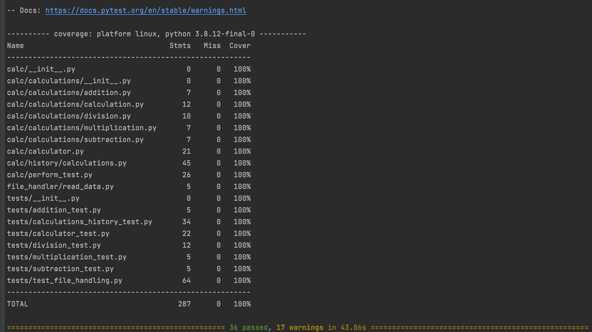
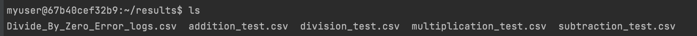
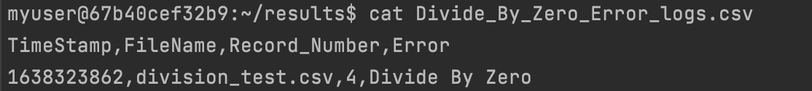
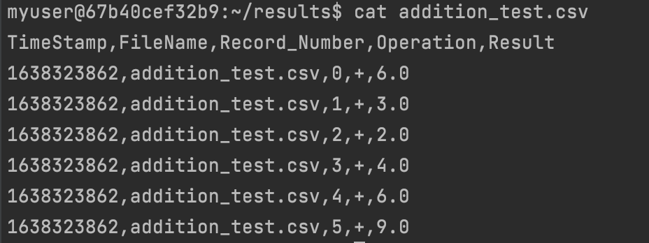
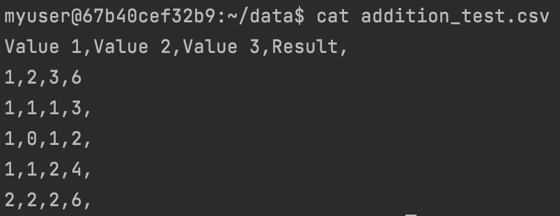

# FirstPythonProjectIS601-F21
# Name - Smeet Kathiria, NET ID -sbk36
# This repo contain code files for calculator that performs calculations and testing on external data files.
# Starting point of the program can be found in below link in test_file_handling.py. 

[Test File Handling](https://github.com/sbk36/FirstPythonProjectIS218-F21/blob/calc_file_handling_SK/App/tests/test_file_handling.py)

# Below Image shows all the log files created in results directory 

# Below Image shows the log data created for divide by zero 

# Below Image shows the log data created for addition test 

# Below Image shows the original test csv files that were used from data directory 

# Below Image shows the sample input file for addition test

#Below Link contains video of the working functionality of what is described above.
#You will need office 365 account to view the video, NJIT students have free access to office 365. 
#If link does not work kindly contact me on sbk36@njit.edu.

[Working Demo Video](https://njit0-my.sharepoint.com/:v:/g/personal/sbk36_njit_edu/EUe_aO48U_ZKjXhVDyh5H8wB0qJq_VEb-drqNiFRBpj-Zw?e=dFyEgq)
