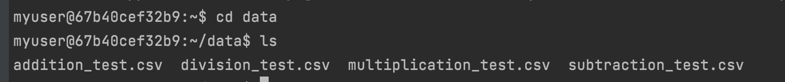

# FirstPythonProjectIS601-F21
# Name - Smeet Kathiria, NET ID -sbk36
# This repo contain code files for calculator that performs calculations and testing on external data files.
# Starting point of the program can be found in test_file_handling.py. 

# Below Image shows all the log files created in results directory 

# Below Image shows all the log files created for divide by zero 

# Below Image shows all the log files created for addition test 

# Below Image shows the original test csv files that were used from data directory 

# Below Image shows the sample input file for addition test
